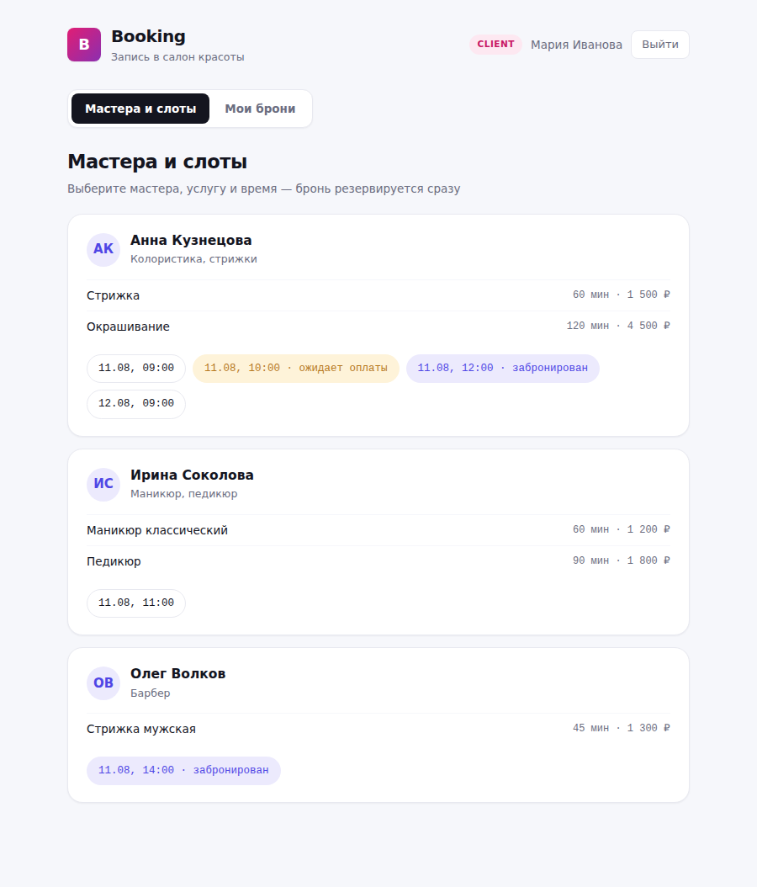
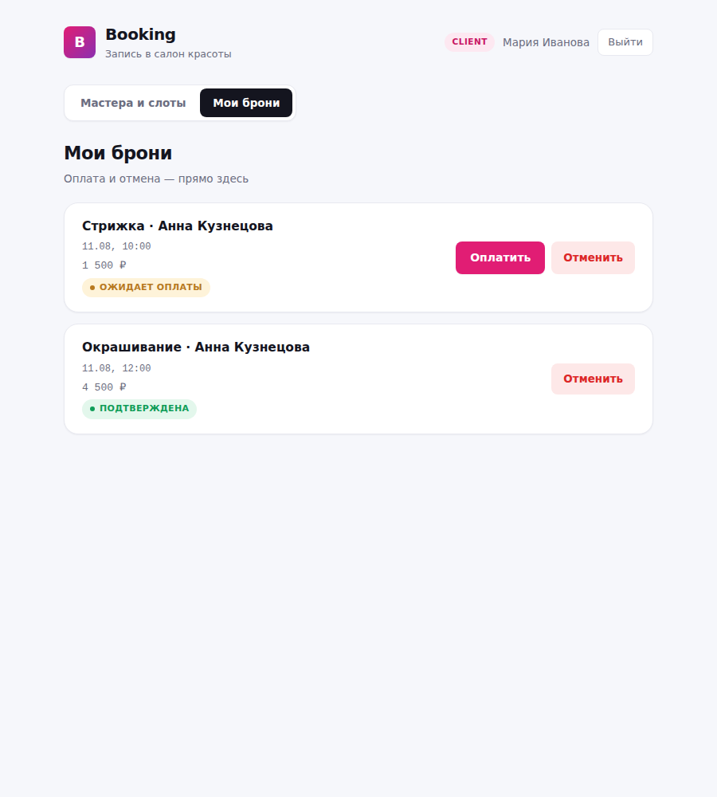
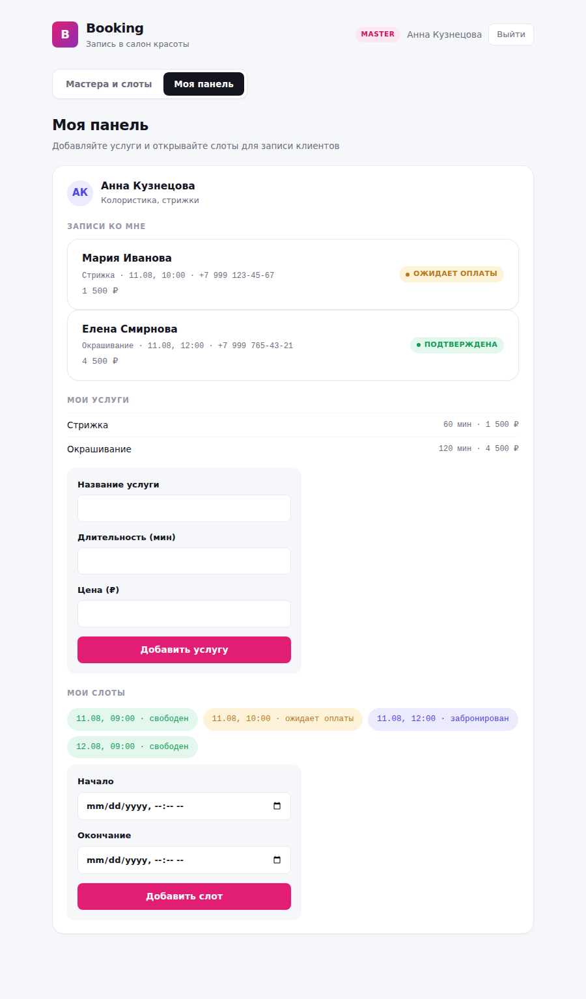
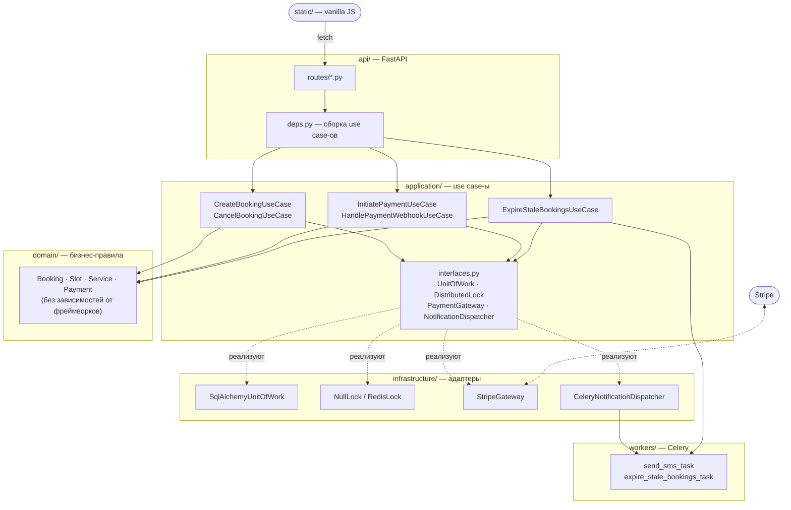

# Booking API


> Перед публикацией замените `YOUR_USERNAME/YOUR_REPO` в бейдже Tests на свой репозиторий
> (или удалите строку, пока не запушили — до первого прогона CI бейдж будет битым).

**Асинхронный сервис бронирования на FastAPI** с защитой от двойного бронирования,
онлайн-оплатой Stripe и фоновыми задачами на Celery. Спроектирован как pet-проект
уровня мидл+ — с прицелом на вопросы, которые реально звучат на собеседованиях:
конкурентный доступ, чистая архитектура, платежи, асинхронность.

Пример предметной области — запись в салон красоты (мастер → услуги → слоты → бронь),
но доменная модель достаточно общая, чтобы лечь в основу любого сервиса бронирования
ресурсов (переговорки, врачи, прокат оборудования).

---

## Содержание

- [Что внутри](#что-внутри)
- [Архитектура](#архитектура)
- [Защита от двойного бронирования](#защита-от-двойного-бронирования)
- [Технологии](#технологии)
- [Быстрый старт](#быстрый-старт)
- [Docker Compose](#docker-compose)
- [Тесты](#тесты)
- [Нагрузочный тест](#нагрузочный-тест)
- [API и авторизация](#api-и-авторизация)
- [Структура проекта](#структура-проекта)
- [Известные ограничения](#известные-ограничения)

---

## Скриншоты

| Каталог мастеров | Мои брони | Панель мастера |
|---|---|---|
|  |  |  |

Ещё: [форма бронирования](./screenshots/04-client-book-form.png) ·
[админ-панель](./screenshots/07-admin-panel.png) ·
[вход](./screenshots/01-auth-login.png) / [регистрация](./screenshots/02-auth-register.png)

Обратите внимание на цветовую индикацию слотов на первом скриншоте — свободные, ожидающие
оплаты и уже забронированные различаются с первого взгляда, без необходимости читать текст.

## Что внутри

- 🔐 **JWT-авторизация с ролями** (`client` / `master` / `admin`)
- 📅 **Бронирование слотов** с проверкой пересечений и длительности услуги
- ⚡ **Защита от гонок** — две сменные стратегии (DB-constraint и Redis distributed lock),
  проверено тестом на 50 параллельных запросов на реальных Postgres+Redis
- 💳 **Оплата через Stripe** (test mode) — с retry при неудаче и авто-аннуляцией по лимиту попыток
- 🔁 **Фоновые задачи на Celery** — автоотмена неоплаченных броней по таймауту, SMS-уведомления
- 🧱 **Чистая (гексагональная) архитектура** — домен не знает про FastAPI/SQLAlchemy/Stripe/Celery
- 🖥️ **Фронтенд на vanilla JS** — без сборщика, полный цикл прямо в браузере
- ✅ **Тесты на всех уровнях** — юнит на fake-адаптерах, интеграционные на SQLite, честный
  concurrency-тест на testcontainers
- 🐳 **Docker Compose** — Postgres, Redis, API, Celery worker, Celery beat одной командой
- 🔄 **CI** — GitHub Actions гоняет тесты на каждый push/PR

## Архитектура

Clean/Hexagonal: `domain` и `application` не зависят от конкретных технологий — только от
Protocol-интерфейсов (`app/application/interfaces.py`). Все интеграции (БД, Redis, Stripe,
Celery) подключены как заменяемые адаптеры в `infrastructure/`.



Практический эффект такого разделения: бизнес-правила (например, «нельзя забронировать
слот короче услуги» или «отменить можно только pending/confirmed бронь») тестируются
без БД, без сети, без моков фреймворка — это чистые Python-объекты в `domain/entities.py`.

## Защита от двойного бронирования

Ключевой сценарий: два клиента одновременно жмут «забронировать» один и тот же слот.
Реализованы **обе** классические стратегии, переключение — одной переменной окружения
`BOOKING_LOCK_STRATEGY=db|redis`:

| Стратегия | Механизм | Когда использовать |
|---|---|---|
| `db` *(по умолчанию)* | `SELECT ... FOR UPDATE` + UNIQUE constraint на `bookings.slot_id`, `IntegrityError` → доменный `BookingConflictError` | Проще, не требует Redis, хватает для большинства нагрузок |
| `redis` | Распределённый лок `SET NX PX` + Lua-скрипт на релиз (с проверкой владельца токена) поверх той же DB-защиты | Высокая конкуренция на горячих слотах — не тратим транзакцию впустую |

Тест `tests/test_concurrency.py` прогоняет **50 параллельных запросов** на один слот для
обеих стратегий на настоящих Postgres+Redis (через `testcontainers`, поднимаются
автоматически):

```
[db strategy]    50 параллельных запросов -> 1 успех, 49 корректных конфликтов
[redis strategy] 50 параллельных запросов -> 1 успех, 49 корректных конфликтов
```

## Технологии

`Python 3.12` · `FastAPI` · `SQLAlchemy 2.0 (async)` · `PostgreSQL` / `SQLite` ·
`Alembic` · `Redis` · `Celery` · `Stripe` · `Pydantic v2` · `pytest` + `pytest-asyncio` +
`testcontainers` · `Docker Compose` · `GitHub Actions` · vanilla `JavaScript`

## Быстрый старт

```bash
git clone <ваш-репозиторий>
cd booking-api

python -m venv .venv
source .venv/bin/activate        # Windows: .venv\Scripts\activate
pip install -r requirements.txt

cp .env.example .env
alembic upgrade head

python -m scripts.create_admin --email admin@example.com --password adminpass123 --full-name "Admin"
python -m scripts.seed_demo_data   # опционально: демо-мастера с услугами и слотами

uvicorn app.main:app --reload
```

Откройте:
- **Фронтенд** — http://localhost:8000/
- **Swagger UI** — http://localhost:8000/docs

<details>
<summary>Как авторизоваться в Swagger UI</summary>

1. `POST /api/auth/login` → "Try it out" → `{"email": "admin@example.com", "password": "adminpass123"}` → Execute
2. Скопируйте `access_token` из ответа
3. Кнопка 🔒 "Authorize" вверху страницы → вставьте токен в поле "Value" → Authorize

(Используется `HTTPBearer`, а не стандартная OAuth2-форма — наш логин принимает JSON, а не form-data.)
</details>

<details>
<summary>Фоновые задачи (Celery) — если нужны локально без Docker</summary>

```bash
docker run -d -p 6379:6379 redis:7-alpine   # брокер

# в отдельных терминалах:
celery -A app.workers.celery_app worker --loglevel=info
celery -A app.workers.celery_app beat --loglevel=info
```
</details>

## Docker Compose

Поднимает всё сразу: Postgres, Redis, API, Celery worker, Celery beat.

```bash
docker compose up --build
```

Миграции применяются автоматически при старте. API — на `http://localhost:8000`.

## Тесты

```bash
# Быстрые: SQLite, секунды, без Docker/Redis/реального Stripe — это же гоняет CI
pytest tests/test_auth_and_catalog.py tests/test_booking_flow.py \
       tests/test_payment_flow.py tests/test_booking_maintenance.py -v

# Главный тест: конкурентный доступ на реальных Postgres+Redis (нужен Docker)
pytest tests/test_concurrency.py -v -s
```

Оплата тестируется через `FakePaymentGateway` (никаких реальных ключей Stripe не нужно).
Уведомления — через `FakeNotificationDispatcher` (никакого реального Redis-брокера).

## Нагрузочный тест

```bash
python -m scripts.seed_demo_data
uvicorn app.main:app                      # в отдельном терминале
locust -f locustfile.py --host http://localhost:8000
```

Откройте `http://localhost:8089`, задайте число пользователей → Start. RPS/latency —
во вкладке Statistics. Тест read-only (листает каталог мастеров/слотов), гонять можно
сколько угодно раз без побочных эффектов.

## API и авторизация

Полная интерактивная документация — `/docs` (Swagger) и `/redoc`. Основные группы эндпоинтов:

| Группа | Примеры |
|---|---|
| `auth` | регистрация клиента, логин (JWT) |
| `masters` | список мастеров/услуг/слотов (публично), создание мастера (только admin) |
| `bookings` | создать бронь, оплатить, отменить, «мои брони» |
| `webhooks` | приём событий Stripe (проверка подписи) |

Роли: `client` регистрируется сам; `master` заводит `admin` через `scripts/create_admin.py`
→ `POST /api/admin/masters`.

## Структура проекта

```
app/
  domain/            # сущности и бизнес-правила — без зависимостей от фреймворков
  application/        # use case-ы + Protocol-порты (interfaces.py)
  infrastructure/       # адаптеры: SQLAlchemy, Redis-лок, Stripe, Celery-уведомления
  workers/                # Celery-приложение и таски
  api/                      # FastAPI-роуты, Pydantic-схемы, DI
  core/                       # конфиг, JWT/хеширование
scripts/               # create_admin.py, seed_demo_data.py
static/                # vanilla JS фронтенд
alembic/               # миграции БД
tests/                 # unit / integration / concurrency
locustfile.py          # нагрузочный тест
docker-compose.yml      # db, redis, app, worker, beat
.github/workflows/       # CI
```

Подробный, пошаговый журнал разработки (по этапам, с обоснованием решений) — в
[`DEVELOPMENT_LOG.md`](./DEVELOPMENT_LOG.md).

## Известные ограничения

Осознанные компромиссы pet-проекта — стоит явно проговорить на собеседовании:

- Фронтенд не завершает реальный платёж (нет Stripe.js Elements с настоящей формой карты) —
  показывает, что `PaymentIntent` создан, дальше нужен реальный ключ Stripe и виджет оплаты.
- Нет rate limiting и полноценного observability (метрики/трейсинг) — для прод-версии нужны.
- `test_concurrency.py` не входит в CI (нужен Docker-in-Docker) — гоняется локально.
- Часовые пояса не учитываются (по требованиям проекта) — все времена в UTC.
- Уведомления (SMS-заглушка) — best-effort: публикуются в фоновом потоке без ожидания
  результата, поэтому недоступность Redis никак не влияет на скорость ответа API.

